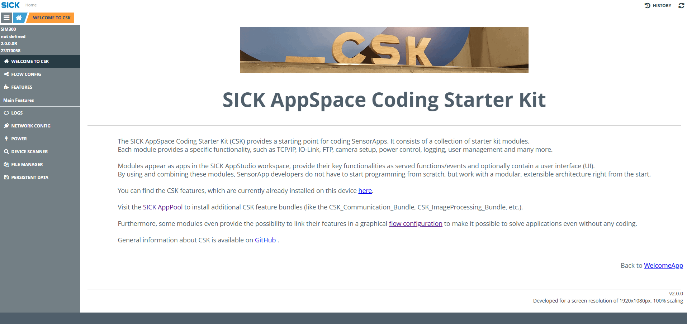

# CSK_Application_FlowConfig

Application to make use of the FlowConfig feature and multiple CSK modules to solve different use cases.  
Mainly this CSK application is only needed to merge content of other CSK modules.  

## How to Run

For further information check out the [documentation](https://raw.githack.com/SICKAppSpaceCodingStarterKit/CSK_Application_FlowConfig/main/docu/CSK_Application_FlowConfig.html) in the folder "docu".

## Information

Developed for a screen resolution of 1920x1080px, 100% scaling.

Tested on:
|Device|Firmware|Module version|
|--|--|--|
|SIM300|V1.1.0|V2.0.0|
|SICK AppEngine|V1.7.0|V1.0.0|
|SIM1012|V2.4.2|V1.0.0|

Following CSK modules are used for this application via Git subtrees and should NOT be further developed within this repository (see [contribution guideline](https://github.com/SICKAppSpaceCodingStarterKit/.github/blob/main/Contribution_Guideline.md) of this GitHub organization):  

  * CSK_1stModule_Logger (release v4.2.1)
  * CSK_FlowConfig_FeatureBlocks (release v1.1.1)
  * CSK_Module_Commands (release v1.0.1)
  * CSK_Module_DateTime (release v3.3.0)
  * CSK_Module_Dashboard (release v1.0.0)
  * CSK_Module_DeviceNetworkConfig (release v2.2.2)
  * CSK_Module_DeviceScanner (release v2.1.1)
  * CSK_Module_FileManager (release v1.1.1)
  * CSK_Module_FlowConfig (release v1.4.0)
  * CSK_Module_LicenseManager (release v1.0.0)
  * CSK_Module_MultiDataLogger (release v2.1.0)
  * CSK_Module_PersistentData (release v4.2.2)
  * CSK_Module_PowerManager  (release v2.6.1)
  * CSK_Module_RecipeManager  (release v1.0.2)
  * CSK_Module_ResultManager (release v2.1.1)
  * CSK_Module_SensorAppOverview (release v1.0.1)

This application is part of the SICK AppSpace Coding Starter Kit developing approach.  
It is programmed in an object oriented way. Some of the modules use kind of "classes" in Lua to make it possible to reuse code / classes in other projects.  
In general it is not neccessary to code this way, but the architecture of this app can serve as a sample to be used especially for bigger projects and to make it easier to share code.  
Please check the [documentation](https://github.com/SICKAppSpaceCodingStarterKit/.github/blob/main/docu/SICKAppSpaceCodingStarterKit_Documentation.md) of CSK for further information.  

## Topics

Coding Starter Kit, CSK, Module, SICK-AppSpace, Flow, FlowConfig, Configuration, No Code, Low Code
